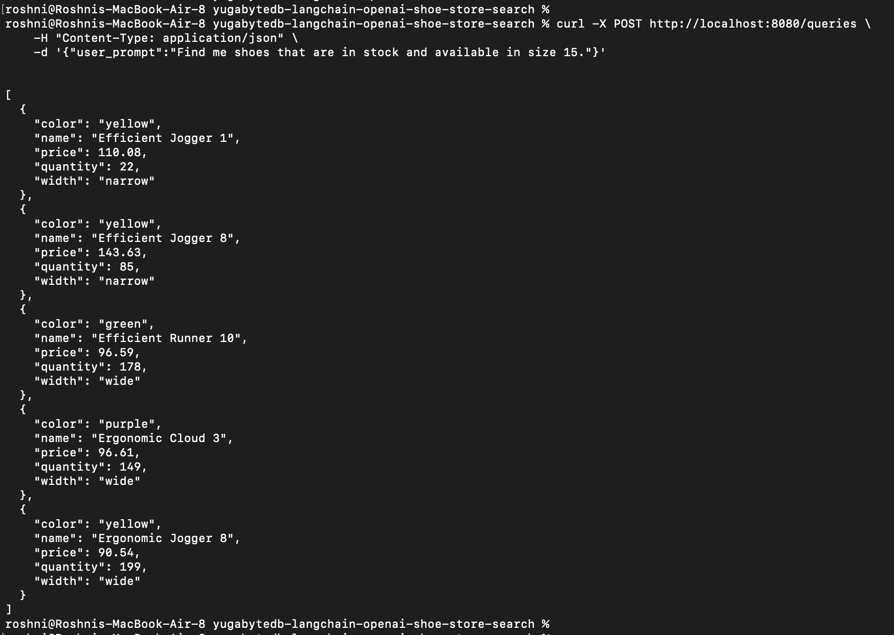
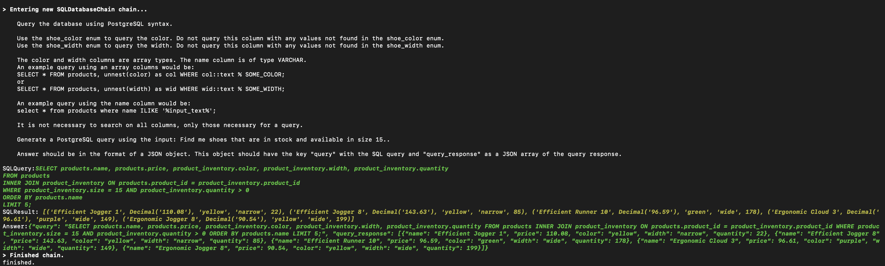

# YugaByte-Langchain-App

This project is an AI-powered application that converts **natural language queries into SQL** using **LangChain** and **OpenAI**, and fetches real-time data from a **YugabyteDB** PostgreSQL-compatible database — all containerized with Docker.
### Tech Stack

- 🧩 [LangChain](https://github.com/langchain-ai/langchain)
- 💬 [OpenAI GPT-3.5/4 API](https://platform.openai.com/)
- 🗄️ [YugabyteDB](https://www.yugabyte.com/)
- 🐳 Docker (for DB cluster setup)
- 🐍 Flask (for backend server)
- 🧪 SQLAlchemy (for DB interaction)
  
> Example: Ask “Find me shoes that are in stock and available in size 15,” and get back JSON results instantly!

#### CURL Query & JSON Output

#### LangChain SQL Generation

